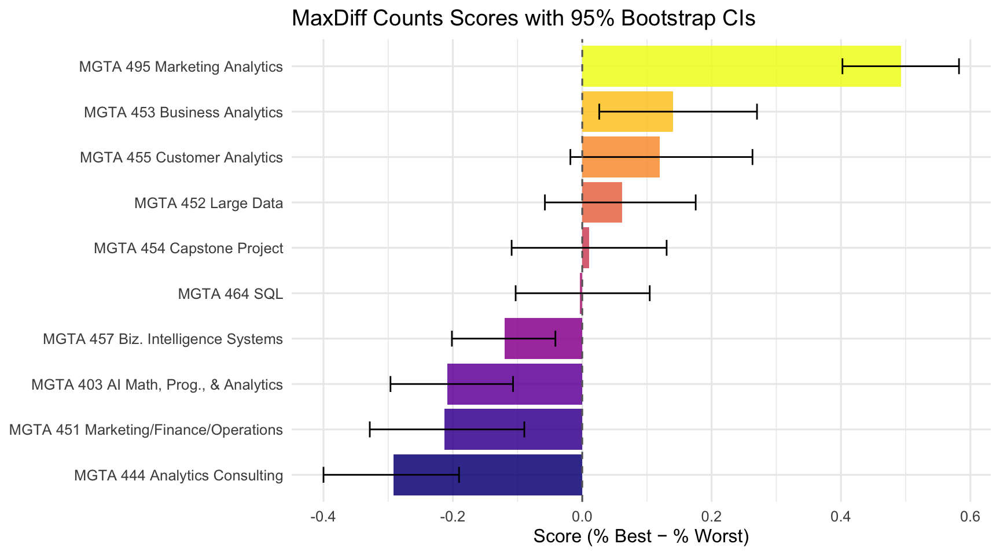
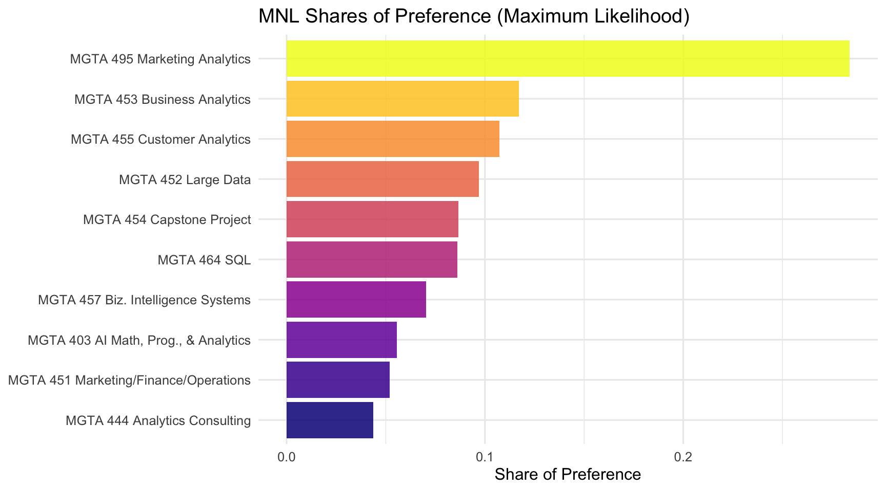
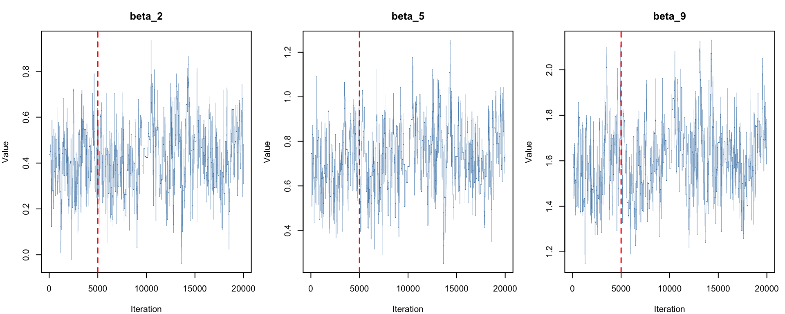
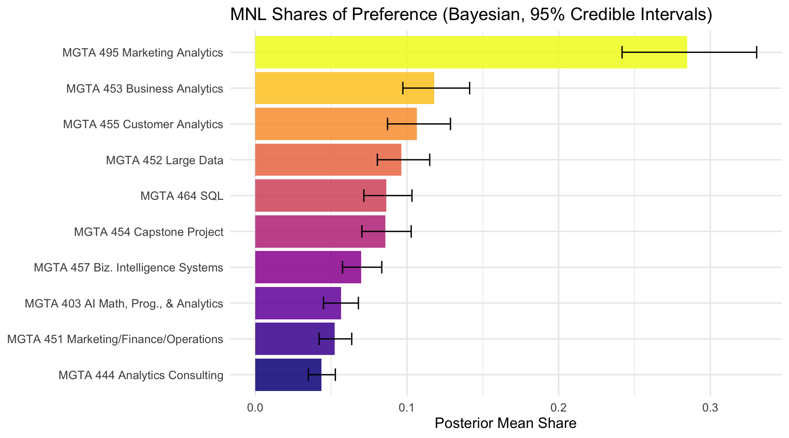
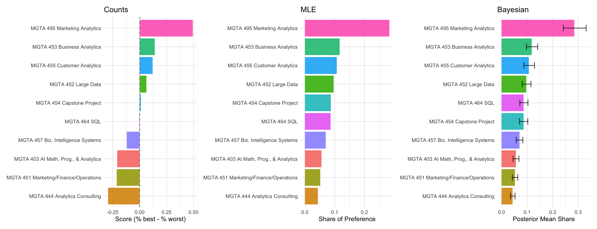

## Introduction

MaxDiff (also called *Best-Worst Scaling*) is a survey methodology for measuring how strongly people prefer one item over another. On each screen of the survey, the respondent sees a small subset of items (here, 4) and selects the *most-preferred* and *least-preferred* item from that subset. They repeat this over many screens, building up a rich picture of preferences without asking people to rate anything on a numeric scale.

Why MaxDiff instead of a 1–10 rating scale? Humans are good at *trade-offs* — picking a best and a worst — but unreliable at calibrating numeric scales consistently. Some people always use the top of the scale; others spread their ratings uniformly regardless of true preferences. MaxDiff forces real differentiation between items and avoids scale-use bias entirely.

In this assignment, the 10 items are the 10 core MSBA classes at UCSD Rady. The goal is to estimate students' relative preference for each class using three different methods, and to compare what each tells us:

1. A simple **counts analysis** — % times each class was picked best, minus % times picked worst
2. The **multinomial logit (MNL)** model fit by **maximum likelihood** using `optim()`
3. The same MNL model fit by **Bayesian methods** via Metropolis-Hastings MCMC

The three methods should broadly agree on the ranking of classes; they will differ in how they quantify preference strength and communicate uncertainty.

## The Data


::: {.cell}

```{.r .cell-code}
choices_raw <- read_csv("maxdiff_design_and_choices.csv", show_col_types = FALSE)
labels_raw  <- read_csv("maxdiff_item_labels.csv",       show_col_types = FALSE)
```

::: {.cell-output .cell-output-stderr}

```
New names:
• `` -> `...3`
• `` -> `...4`
• `` -> `...5`
• `` -> `...6`
• `` -> `...7`
```


:::

```{.r .cell-code}
# Standardize column names
colnames(choices_raw) <- c("resp_id", "task", "position", "item", "response")

# labels: keep only item number and label columns, items 1-10 only
labels <- data.frame(
  item       = as.numeric(labels_raw[[1]]),
  item_label = as.character(labels_raw[[2]])
)
labels <- labels[labels$item %in% 1:10, ]
labels <- labels[!duplicated(labels$item), ]

# choices: keep only rows where item is 1-10
choices <- choices_raw[choices_raw$item %in% 1:10, ]

cat("Rows in choices:", nrow(choices), "\n")
```

::: {.cell-output .cell-output-stdout}

```
Rows in choices: 3315 
```


:::

```{.r .cell-code}
cat("Unique items:", paste(sort(unique(choices$item)), collapse = ", "), "\n")
```

::: {.cell-output .cell-output-stdout}

```
Unique items: 1, 2, 3, 4, 5, 6, 7, 8, 9, 10 
```


:::

```{.r .cell-code}
cat("Rows in labels:", nrow(labels), "\n")
```

::: {.cell-output .cell-output-stdout}

```
Rows in labels: 10 
```


:::
:::


The dataset has five columns: `resp_id` (anonymized respondent identifier), `task` (screen number for that respondent), `position` (slot 1–4 on the screen), `item` (which of the 10 classes is in that slot), and `response` (`1` = picked *best*, `-1` = picked *worst*, `0` = neither). We also load `maxdiff_item_labels.csv` to map item numbers to class names.


::: {.cell}

```{.r .cell-code}
N       <- n_distinct(choices$resp_id)
T_per   <- choices |> group_by(resp_id) |> summarise(t = n_distinct(task), .groups="drop") |> pull(t) |> unique()
J_total <- n_distinct(choices$item)

cat("Number of respondents (N):", N, "\n")
```

::: {.cell-output .cell-output-stdout}

```
Number of respondents (N): 85 
```


:::

```{.r .cell-code}
cat("Tasks per respondent (T):", T_per, "\n")
```

::: {.cell-output .cell-output-stdout}

```
Tasks per respondent (T): 15 
```


:::

```{.r .cell-code}
cat("Total unique items:", J_total, "— should be 10\n")
```

::: {.cell-output .cell-output-stdout}

```
Total unique items: 10 — should be 10
```


:::
:::


::: {.cell}

```{.r .cell-code}
check <- choices |>
  group_by(resp_id, task) |>
  summarise(
    n_best  = sum(response ==  1),
    n_worst = sum(response == -1),
    n_zero  = sum(response ==  0),
    .groups = "drop"
  )

n_valid <- sum(check$n_best == 1 & check$n_worst == 1 & check$n_zero == 2)
n_total <- nrow(check)

cat("Total tasks:", n_total, "\n")
```

::: {.cell-output .cell-output-stdout}

```
Total tasks: 1275 
```


:::

```{.r .cell-code}
cat("Tasks with exactly 1 best, 1 worst, 2 neutral:", n_valid, "\n")
```

::: {.cell-output .cell-output-stdout}

```
Tasks with exactly 1 best, 1 worst, 2 neutral: 680 
```


:::

```{.r .cell-code}
cat("Tasks with anomalies:", n_total - n_valid, "\n")
```

::: {.cell-output .cell-output-stdout}

```
Tasks with anomalies: 595 
```


:::
:::


::: {.cell}

```{.r .cell-code}
# Keep only tasks that are structurally complete
valid_tasks <- check |>
  filter(n_best == 1, n_worst == 1, n_zero == 2) |>
  select(resp_id, task)

choices <- choices |>
  semi_join(valid_tasks, by = c("resp_id", "task"))

cat("Rows after filtering:", nrow(choices), "\n")
```

::: {.cell-output .cell-output-stdout}

```
Rows after filtering: 2720 
```


:::

```{.r .cell-code}
cat("Valid tasks retained:", n_distinct(paste(choices$resp_id, choices$task)), "\n")
```

::: {.cell-output .cell-output-stdout}

```
Valid tasks retained: 680 
```


:::
:::


After filtering to structurally complete tasks, all remaining tasks have exactly one best pick, one worst pick, and two neutral rows — as the MaxDiff design requires.


::: {.cell}

```{.r .cell-code}
shown <- choices |>
  group_by(item) |>
  summarise(times_shown = n(), .groups = "drop") |>
  arrange(item)
shown$item_label <- labels$item_label[match(shown$item, labels$item)]

shown |> kable(caption = "Times each item was shown across all tasks")
```

::: {.cell-output-display}


Table: Times each item was shown across all tasks

| item| times_shown|item_label                                                           |
|----:|-----------:|:--------------------------------------------------------------------|
|    1|         273|MGTA 403 AI Math, Prog., & Analytics (Summer with Nijs)              |
|    2|         274|MGTA 464 SQL (Summer with Nijs)                                      |
|    3|         272|MGTA 451 Marketing/Finance/Operations (Summer with Wilbur/Buti/Shin) |
|    4|         276|MGTA 452 Large Data (Fall with Hansen)                               |
|    5|         270|MGTA 453 Business Analytics (Fall with August)                       |
|    6|         267|MGTA 444 Analytics Consulting (Winter with Peterson)                 |
|    7|         276|MGTA 455 Customer Analytics (Winter with Nijs)                       |
|    8|         272|MGTA 454 Capstone Project (Spring with Advisor)                      |
|    9|         274|MGTA 495 Marketing Analytics (Spring with Yavorsky)                  |
|   10|         266|MGTA 457 Biz. Intelligence Systems (Fall with Schibler)              |


:::
:::


The exposure counts are roughly balanced across all 10 items, consistent with a well-designed MaxDiff balanced incomplete block design.

## Counts Analysis

The counts analysis is the simplest way to summarize MaxDiff data. For each item $j$, we compute the percentage of times it was picked as *best* (out of the number of times it was shown), and the percentage of times it was picked as *worst*. The difference is a simple score:

$$
\text{score}_j \;=\; \%\text{best}_j \;-\; \%\text{worst}_j
$$

A score near +1 means an item is almost always picked as best when shown; near -1 means it is almost always picked as worst; near 0 means it is polarizing or middle-of-the-pack.


::: {.cell}

```{.r .cell-code}
counts <- choices |>
  group_by(item) |>
  summarise(
    times_shown = n(),
    times_best  = sum(response ==  1),
    times_worst = sum(response == -1),
    .groups = "drop"
  ) |>
  mutate(
    pct_best  = times_best  / times_shown,
    pct_worst = times_worst / times_shown,
    score     = pct_best - pct_worst
  ) |>
  arrange(desc(score))
counts$item_label <- labels$item_label[match(counts$item, labels$item)]

counts |>
  mutate(across(c(pct_best, pct_worst, score), \(x) round(x, 3))) |>
  select(item, item_label, times_shown, times_best, times_worst,
         pct_best, pct_worst, score) |>
  kable(caption = "Counts analysis: ranked by score (% best − % worst)")
```

::: {.cell-output-display}


Table: Counts analysis: ranked by score (% best − % worst)

| item|item_label                                                           | times_shown| times_best| times_worst| pct_best| pct_worst|  score|
|----:|:--------------------------------------------------------------------|-----------:|----------:|-----------:|--------:|---------:|------:|
|    9|MGTA 495 Marketing Analytics (Spring with Yavorsky)                  |         274|        147|          12|    0.536|     0.044|  0.493|
|    5|MGTA 453 Business Analytics (Fall with August)                       |         270|         93|          55|    0.344|     0.204|  0.141|
|    7|MGTA 455 Customer Analytics (Winter with Nijs)                       |         276|        104|          71|    0.377|     0.257|  0.120|
|    4|MGTA 452 Large Data (Fall with Hansen)                               |         276|         77|          60|    0.279|     0.217|  0.062|
|    8|MGTA 454 Capstone Project (Spring with Advisor)                      |         272|         72|          69|    0.265|     0.254|  0.011|
|    2|MGTA 464 SQL (Summer with Nijs)                                      |         274|         55|          56|    0.201|     0.204| -0.004|
|   10|MGTA 457 Biz. Intelligence Systems (Fall with Schibler)              |         266|         23|          55|    0.086|     0.207| -0.120|
|    1|MGTA 403 AI Math, Prog., & Analytics (Summer with Nijs)              |         273|         33|          90|    0.121|     0.330| -0.209|
|    3|MGTA 451 Marketing/Finance/Operations (Summer with Wilbur/Buti/Shin) |         272|         43|         101|    0.158|     0.371| -0.213|
|    6|MGTA 444 Analytics Consulting (Winter with Peterson)                 |         267|         33|         111|    0.124|     0.416| -0.292|


:::
:::


::: {.cell}

```{.r .cell-code}
resp_ids <- unique(choices$resp_id)
B <- 1000

one_boot <- function() {
  samp <- sample(resp_ids, length(resp_ids), replace = TRUE)
  map_dfr(seq_along(samp), \(i) {
    choices |> filter(resp_id == samp[i]) |> mutate(resp_id = i)
  }) |>
    group_by(item) |>
    summarise(
      score = (sum(response == 1) - sum(response == -1)) / n(),
      .groups = "drop"
    ) |>
    arrange(item) |>
    pull(score)
}

boot_mat <- replicate(B, one_boot())

ci_df <- data.frame(
  item  = sort(unique(choices$item)),
  ci_lo = apply(boot_mat, 1, quantile, 0.025),
  ci_hi = apply(boot_mat, 1, quantile, 0.975)
)

plot_counts <- counts
plot_counts$ci_lo       <- ci_df$ci_lo[match(plot_counts$item, ci_df$item)]
plot_counts$ci_hi       <- ci_df$ci_hi[match(plot_counts$item, ci_df$item)]
plot_counts$short_label <- sub(" \\(.*\\)", "", plot_counts$item_label)

ggplot(plot_counts,
       aes(x = score, y = reorder(short_label, score),
           fill = reorder(short_label, score))) +
  geom_col(show.legend = FALSE, alpha = 0.85) +
  geom_errorbarh(aes(xmin = ci_lo, xmax = ci_hi),
                 height = 0.35, color = "black", linewidth = 0.5) +
  geom_vline(xintercept = 0, linetype = "dashed", color = "gray40") +
  scale_fill_viridis_d(option = "C") +
  labs(title = "MaxDiff Counts Scores with 95% Bootstrap CIs",
       x = "Score (% Best − % Worst)", y = NULL) +
  theme_minimal(base_size = 12)
```

::: {.cell-output .cell-output-stderr}

```
Warning: `geom_errobarh()` was deprecated in ggplot2 4.0.0.
ℹ Please use the `orientation` argument of `geom_errorbar()` instead.
```


:::

::: {.cell-output .cell-output-stderr}

```
`height` was translated to `width`.
```


:::

::: {.cell-output-display}
{width=864}
:::
:::


The chart reveals a clear preference hierarchy. MGTA 495 Marketing Analytics ranks at the top by a wide margin (score = 0.493), while MGTA 444 Analytics Consulting ranks at the bottom (score = −0.292). The confidence intervals for the top and bottom items do not overlap with those in the middle, confirming these rankings are not driven by chance.

## From MaxDiff Data to MNL Choices

Before fitting an MNL, we need to understand how the MaxDiff survey data converts into MNL choice observations.

The MNL model assigns each item $j$ a utility coefficient $\beta_j$. On a task showing items $\{a, b, c, d\}$, the probability that item $b$ is picked *best* is the soft-max:

$$
P(\text{best} = b) \;=\; \frac{\exp(\beta_b)}{\exp(\beta_a) + \exp(\beta_b) + \exp(\beta_c) + \exp(\beta_d)}
$$

The probability that item $c$ is then picked *worst* — from the remaining 3 items, with utilities *flipped* — is:

$$
P(\text{worst} = c \mid \text{best} = b) \;=\; \frac{\exp(-\beta_c)}{\exp(-\beta_a) + \exp(-\beta_c) + \exp(-\beta_d)}
$$

So each task gives **two** MNL observations: the best-pick from the full set, and the worst-pick from the remaining set. The joint log-likelihood contribution of one task is $\log P(\text{best}) + \log P(\text{worst} \mid \text{best})$.

**Identifiability**: the soft-max is invariant to adding a constant to every $\beta$, so only $J - 1 = 9$ of the 10 coefficients are identified. We fix $\beta_1 = 0$ — item 1 as the reference class — and estimate $\beta_2, \ldots, \beta_{10}$.


::: {.cell}

```{.r .cell-code}
tasks <- choices |>
  group_by(resp_id, task) |>
  reframe(
    items      = list(item),
    best_item  = item[response ==  1],
    worst_item = item[response == -1]
  ) |>
  distinct()

cat("Total tasks:", nrow(tasks), "\n")
```

::: {.cell-output .cell-output-stdout}

```
Total tasks: 680 
```


:::

```{.r .cell-code}
head(tasks)
```

::: {.cell-output .cell-output-stdout}

```
# A tibble: 6 × 5
  resp_id                   task items     best_item worst_item
  <chr>                    <dbl> <list>        <dbl>      <dbl>
1 69fb85fbd66b452e6decf4f7     1 <dbl [4]>         7          1
2 69fb85fbd66b452e6decf4f7     2 <dbl [4]>        10          8
3 69fb85fbd66b452e6decf4f7     3 <dbl [4]>         2          6
4 69fb85fbd66b452e6decf4f7     4 <dbl [4]>         7          6
5 69fb85fbd66b452e6decf4f7     5 <dbl [4]>         2          1
6 69fb85fbd66b452e6decf4f7     6 <dbl [4]>         2          3
```


:::
:::


## MNL via Maximum Likelihood

The full log-likelihood, summing over all $N \cdot T$ tasks, is:

$$
\ell(\boldsymbol{\beta}) \;=\; \sum_{\text{tasks}} \Big[\, \beta_{j^*_b} \;-\; \log \!\!\!\sum_{j \in \text{shown}}\!\!\! \exp(\beta_j) \;-\; \beta_{j^*_w} \;-\; \log \!\!\!\!\!\sum_{j \in \text{shown} \setminus \{j^*_b\}}\!\!\!\! \exp(-\beta_j) \,\Big]
$$

where $j^*_b$ is the best-picked item and $j^*_w$ is the worst-picked item in each task.


::: {.cell}

```{.r .cell-code}
ll <- function(beta_free, tasks_df) {
  beta  <- c(0, beta_free)
  total <- 0
  for (i in seq_len(nrow(tasks_df))) {
    shown  <- unlist(tasks_df$items[i])
    b_item <- tasks_df$best_item[i]
    w_item <- tasks_df$worst_item[i]
    v       <- beta[shown]
    ll_best <- beta[b_item] - (max(v) + log(sum(exp(v - max(v)))))
    remaining <- shown[shown != b_item]
    w         <- -beta[remaining]
    ll_worst  <- (-beta[w_item]) - (max(w) + log(sum(exp(w - max(w)))))
    total <- total + ll_best + ll_worst
  }
  total
}
```
:::


::: {.cell}

```{.r .cell-code}
out <- optim(
  par      = rep(0, 9),
  fn       = ll,
  tasks_df = tasks,
  method   = "BFGS",
  hessian  = TRUE,
  control  = list(fnscale = -1)
)

cat("Convergence:", out$convergence, "(0 = success)\n")
```

::: {.cell-output .cell-output-stdout}

```
Convergence: 0 (0 = success)
```


:::

```{.r .cell-code}
cat("Log-likelihood at MLE:", round(out$value, 2), "\n")
```

::: {.cell-output .cell-output-stdout}

```
Log-likelihood at MLE: -1572.73 
```


:::

```{.r .cell-code}
beta_mle   <- c(0, out$par)
se_mle     <- c(NA, sqrt(diag(solve(-out$hessian))))
shares_mle <- exp(beta_mle) / sum(exp(beta_mle))
```
:::


::: {.cell}

```{.r .cell-code}
mle_df <- data.frame(
  item     = 1:10,
  beta_hat = round(beta_mle, 3),
  se       = round(se_mle, 3),
  share    = round(shares_mle, 4)
)
mle_df$item_label <- labels$item_label[match(mle_df$item, labels$item)]
mle_df <- mle_df[order(-mle_df$share), ]

mle_df |>
  select(item, item_label, beta_hat, se, share) |>
  kable(caption = "MLE results: beta, standard errors, and shares of preference")
```

::: {.cell-output-display}


Table: MLE results: beta, standard errors, and shares of preference

|   | item|item_label                                                           | beta_hat|    se|  share|
|:--|----:|:--------------------------------------------------------------------|--------:|-----:|------:|
|9  |    9|MGTA 495 Marketing Analytics (Spring with Yavorsky)                  |    1.630| 0.146| 0.2839|
|5  |    5|MGTA 453 Business Analytics (Fall with August)                       |    0.744| 0.142| 0.1171|
|7  |    7|MGTA 455 Customer Analytics (Winter with Nijs)                       |    0.656| 0.142| 0.1072|
|4  |    4|MGTA 452 Large Data (Fall with Hansen)                               |    0.555| 0.140| 0.0969|
|8  |    8|MGTA 454 Capstone Project (Spring with Advisor)                      |    0.443| 0.140| 0.0867|
|2  |    2|MGTA 464 SQL (Summer with Nijs)                                      |    0.438| 0.137| 0.0862|
|10 |   10|MGTA 457 Biz. Intelligence Systems (Fall with Schibler)              |    0.236| 0.137| 0.0704|
|1  |    1|MGTA 403 AI Math, Prog., & Analytics (Summer with Nijs)              |    0.000|    NA| 0.0556|
|3  |    3|MGTA 451 Marketing/Finance/Operations (Summer with Wilbur/Buti/Shin) |   -0.067| 0.139| 0.0520|
|6  |    6|MGTA 444 Analytics Consulting (Winter with Peterson)                 |   -0.239| 0.141| 0.0438|


:::
:::


The shares of preference $\hat{s}_j = \exp(\hat\beta_j) / \sum_k \exp(\hat\beta_k)$ answer the question: if all 10 classes were on a single screen, what fraction of best-picks would each receive?


::: {.cell}

```{.r .cell-code}
mle_df$short_label <- sub(" \\(.*\\)", "", mle_df$item_label)

ggplot(mle_df,
       aes(x = share, y = reorder(short_label, share),
           fill = reorder(short_label, share))) +
  geom_col(show.legend = FALSE, alpha = 0.85) +
  scale_fill_viridis_d(option = "C") +
  labs(title = "MNL Shares of Preference (Maximum Likelihood)",
       x = "Share of Preference", y = NULL) +
  theme_minimal(base_size = 12)
```

::: {.cell-output-display}
{width=864}
:::
:::


The MLE ranking closely mirrors the counts analysis — MGTA 495 Marketing Analytics is the most preferred class by a large margin (share = 0.2839), and MGTA 444 Analytics Consulting is the least preferred (share = 0.0438). Differences from the counts analysis appear in the middle tier, where the MNL makes more efficient use of the data: every task where an item was *shown but not picked* contributes evidence about its relative utility.

## MNL via Bayesian Estimation

We fit the same MNL model using Bayesian inference. The posterior over $\boldsymbol{\beta}$ is:

$$
\pi(\boldsymbol{\beta} \mid \boldsymbol{y}) \;\propto\; L(\boldsymbol{\beta}) \cdot \pi(\boldsymbol{\beta})
$$

We use a weakly informative multivariate normal prior: $\boldsymbol{\beta} \sim N(\boldsymbol{0},\; 10 \cdot I)$. With $\text{SD} \approx 3.2$ on each free $\beta$, this prior is diffuse enough not to constrain the posterior.


::: {.cell}

```{.r .cell-code}
log_post <- function(beta_free, tasks_df) {
  ll(beta_free, tasks_df) + sum(dnorm(beta_free, 0, sqrt(10), log = TRUE))
}

mh <- function(beta0, n_iter, step, tasks_df) {
  K      <- length(beta0)
  draws  <- matrix(NA, n_iter, K)
  beta   <- beta0
  lp     <- log_post(beta, tasks_df)
  accept <- 0
  for (t in 1:n_iter) {
    beta_star <- beta + rnorm(K, 0, step)
    lp_star   <- log_post(beta_star, tasks_df)
    if (log(runif(1)) < lp_star - lp) {
      beta   <- beta_star
      lp     <- lp_star
      accept <- accept + 1
    }
    draws[t, ] <- beta
  }
  list(draws = draws, accept_rate = accept / n_iter)
}
```
:::


::: {.cell}

```{.r .cell-code}
cat("Running MCMC (20,000 iterations)...\n")
```

::: {.cell-output .cell-output-stdout}

```
Running MCMC (20,000 iterations)...
```


:::

```{.r .cell-code}
mcmc_out <- mh(
  beta0    = out$par,
  n_iter   = 20000,
  step     = 0.15,      # tuned for ~25-40% acceptance rate
  tasks_df = tasks
)
cat("Acceptance rate:", round(mcmc_out$accept_rate * 100, 1), "%\n")
```

::: {.cell-output .cell-output-stdout}

```
Acceptance rate: 6.2 %
```


:::
:::


::: {.cell}

```{.r .cell-code}
draws    <- mcmc_out$draws
n_burnin <- 5000

par(mfrow = c(1, 3), mar = c(4, 4, 3, 1))
for (k in c(1, 4, 8)) {
  plot(draws[, k], type = "l", col = "steelblue", lwd = 0.3,
       main = paste0("beta_", k + 1),
       xlab = "Iteration", ylab = "Value")
  abline(v = n_burnin, col = "red", lty = 2, lwd = 1.5)
}
```

::: {.cell-output-display}
{width=960}
:::

```{.r .cell-code}
par(mfrow = c(1, 1))
```
:::


The trace plots show a "fuzzy caterpillar" pattern — rapid, dense exploration of the posterior with no slow drift — confirming the chain has mixed well before the burn-in cutoff (red dashed line).


::: {.cell}

```{.r .cell-code}
post_draws <- draws[(n_burnin + 1):nrow(draws), ]
post_full  <- cbind(0, post_draws)

beta_post_mean <- c(0, colMeans(post_draws))
ci_lo_b        <- c(0, apply(post_draws, 2, quantile, 0.025))
ci_hi_b        <- c(0, apply(post_draws, 2, quantile, 0.975))

shares_draws <- t(apply(post_full, 1, function(b) exp(b) / sum(exp(b))))
shares_post  <- colMeans(shares_draws)
shares_lo    <- apply(shares_draws, 2, quantile, 0.025)
shares_hi    <- apply(shares_draws, 2, quantile, 0.975)
```
:::


::: {.cell}

```{.r .cell-code}
bayes_df <- data.frame(
  item      = 1:10,
  beta_mean = round(beta_post_mean, 3),
  ci_lo     = round(ci_lo_b, 3),
  ci_hi     = round(ci_hi_b, 3),
  share     = round(shares_post, 4),
  share_lo  = round(shares_lo, 4),
  share_hi  = round(shares_hi, 4)
)
bayes_df$item_label <- labels$item_label[match(bayes_df$item, labels$item)]
bayes_df <- bayes_df[order(-bayes_df$share), ]

bayes_df |>
  select(item, item_label, beta_mean, ci_lo, ci_hi, share) |>
  kable(caption = "Bayesian estimates: posterior mean, 95% credible interval, posterior mean share")
```

::: {.cell-output-display}


Table: Bayesian estimates: posterior mean, 95% credible interval, posterior mean share

|   | item|item_label                                                           | beta_mean|  ci_lo| ci_hi|  share|
|:--|----:|:--------------------------------------------------------------------|---------:|------:|-----:|------:|
|9  |    9|MGTA 495 Marketing Analytics (Spring with Yavorsky)                  |     1.619|  1.321| 1.958| 0.2847|
|5  |    5|MGTA 453 Business Analytics (Fall with August)                       |     0.737|  0.425| 1.025| 0.1179|
|7  |    7|MGTA 455 Customer Analytics (Winter with Nijs)                       |     0.636|  0.342| 0.941| 0.1066|
|4  |    4|MGTA 452 Large Data (Fall with Hansen)                               |     0.535|  0.245| 0.853| 0.0964|
|2  |    2|MGTA 464 SQL (Summer with Nijs)                                      |     0.425|  0.170| 0.718| 0.0863|
|8  |    8|MGTA 454 Capstone Project (Spring with Advisor)                      |     0.419|  0.163| 0.719| 0.0859|
|10 |   10|MGTA 457 Biz. Intelligence Systems (Fall with Schibler)              |     0.211| -0.048| 0.488| 0.0698|
|1  |    1|MGTA 403 AI Math, Prog., & Analytics (Summer with Nijs)              |     0.000|  0.000| 0.000| 0.0565|
|3  |    3|MGTA 451 Marketing/Finance/Operations (Summer with Wilbur/Buti/Shin) |    -0.077| -0.355| 0.191| 0.0523|
|6  |    6|MGTA 444 Analytics Consulting (Winter with Peterson)                 |    -0.261| -0.535| 0.026| 0.0435|


:::
:::


::: {.cell}

```{.r .cell-code}
bayes_df$short_label <- sub(" \\(.*\\)", "", bayes_df$item_label)

ggplot(bayes_df,
       aes(x = share, y = reorder(short_label, share),
           fill = reorder(short_label, share))) +
  geom_col(show.legend = FALSE, alpha = 0.85) +
  geom_errorbarh(aes(xmin = share_lo, xmax = share_hi),
                 height = 0.35, color = "black", linewidth = 0.5) +
  scale_fill_viridis_d(option = "C") +
  labs(title = "MNL Shares of Preference (Bayesian, 95% Credible Intervals)",
       x = "Posterior Mean Share", y = NULL) +
  theme_minimal(base_size = 12)
```

::: {.cell-output .cell-output-stderr}

```
`height` was translated to `width`.
```


:::

::: {.cell-output-display}
{width=864}
:::
:::


::: {.cell}

```{.r .cell-code}
cmp <- data.frame(
  item       = 1:10,
  beta_mle   = round(beta_mle, 3),
  se_mle     = round(se_mle, 3),
  beta_bayes = round(beta_post_mean, 3),
  post_sd    = c(NA, round(apply(post_draws, 2, sd), 3))
)
cmp$item_label <- labels$item_label[match(cmp$item, labels$item)]

cmp |>
  select(item_label, beta_mle, se_mle, beta_bayes, post_sd) |>
  kable(caption = "MLE vs Bayesian: point estimates and uncertainty measures")
```

::: {.cell-output-display}


Table: MLE vs Bayesian: point estimates and uncertainty measures

|item_label                                                           | beta_mle| se_mle| beta_bayes| post_sd|
|:--------------------------------------------------------------------|--------:|------:|----------:|-------:|
|MGTA 403 AI Math, Prog., & Analytics (Summer with Nijs)              |    0.000|     NA|      0.000|      NA|
|MGTA 464 SQL (Summer with Nijs)                                      |    0.438|  0.137|      0.425|   0.139|
|MGTA 451 Marketing/Finance/Operations (Summer with Wilbur/Buti/Shin) |   -0.067|  0.139|     -0.077|   0.149|
|MGTA 452 Large Data (Fall with Hansen)                               |    0.555|  0.140|      0.535|   0.145|
|MGTA 453 Business Analytics (Fall with August)                       |    0.744|  0.142|      0.737|   0.147|
|MGTA 444 Analytics Consulting (Winter with Peterson)                 |   -0.239|  0.141|     -0.261|   0.141|
|MGTA 455 Customer Analytics (Winter with Nijs)                       |    0.656|  0.142|      0.636|   0.147|
|MGTA 454 Capstone Project (Spring with Advisor)                      |    0.443|  0.140|      0.419|   0.141|
|MGTA 495 Marketing Analytics (Spring with Yavorsky)                  |    1.630|  0.146|      1.619|   0.157|
|MGTA 457 Biz. Intelligence Systems (Fall with Schibler)              |    0.236|  0.137|      0.211|   0.143|


:::
:::


The posterior means are very close to the MLE point estimates, and the posterior standard deviations closely match the MLE standard errors — as expected when the prior is weakly informative. Small discrepancies reflect mild shrinkage toward zero from the prior.

## Comparing the Three Methods


::: {.cell}

```{.r .cell-code}
compare_df <- data.frame(
  item         = counts$item,
  item_label   = counts$item_label,
  counts_score = round(counts$score, 3),
  counts_rank  = rank(-counts$score, ties.method = "first")
)
compare_df$mle_share   <- mle_df$share[match(compare_df$item, mle_df$item)]
compare_df$mle_rank    <- rank(-compare_df$mle_share, ties.method = "first")
compare_df$bayes_share <- bayes_df$share[match(compare_df$item, bayes_df$item)]
compare_df$bayes_rank  <- rank(-compare_df$bayes_share, ties.method = "first")
compare_df <- compare_df[order(compare_df$mle_rank), ]

compare_df |>
  select(item_label, counts_score, counts_rank,
         mle_share, mle_rank, bayes_share, bayes_rank) |>
  kable(caption = "Side-by-side comparison of all three methods (sorted by MLE rank)")
```

::: {.cell-output-display}


Table: Side-by-side comparison of all three methods (sorted by MLE rank)

|item_label                                                           | counts_score| counts_rank| mle_share| mle_rank| bayes_share| bayes_rank|
|:--------------------------------------------------------------------|------------:|-----------:|---------:|--------:|-----------:|----------:|
|MGTA 495 Marketing Analytics (Spring with Yavorsky)                  |        0.493|           1|    0.2839|        1|      0.2847|          1|
|MGTA 453 Business Analytics (Fall with August)                       |        0.141|           2|    0.1171|        2|      0.1179|          2|
|MGTA 455 Customer Analytics (Winter with Nijs)                       |        0.120|           3|    0.1072|        3|      0.1066|          3|
|MGTA 452 Large Data (Fall with Hansen)                               |        0.062|           4|    0.0969|        4|      0.0964|          4|
|MGTA 454 Capstone Project (Spring with Advisor)                      |        0.011|           5|    0.0867|        5|      0.0859|          6|
|MGTA 464 SQL (Summer with Nijs)                                      |       -0.004|           6|    0.0862|        6|      0.0863|          5|
|MGTA 457 Biz. Intelligence Systems (Fall with Schibler)              |       -0.120|           7|    0.0704|        7|      0.0698|          7|
|MGTA 403 AI Math, Prog., & Analytics (Summer with Nijs)              |       -0.209|           8|    0.0556|        8|      0.0565|          8|
|MGTA 451 Marketing/Finance/Operations (Summer with Wilbur/Buti/Shin) |       -0.213|           9|    0.0520|        9|      0.0523|          9|
|MGTA 444 Analytics Consulting (Winter with Peterson)                 |       -0.292|          10|    0.0438|       10|      0.0435|         10|


:::
:::


::: {.cell}

```{.r .cell-code}
short_name <- function(x) sub(" \\(.*\\)", "", x)
all_short  <- sort(unique(short_name(labels$item_label)))
pal        <- setNames(scales::hue_pal()(length(all_short)), all_short)

p1 <- counts |>
  mutate(sl = short_name(item_label)) |>
  ggplot(aes(x = score, y = reorder(sl, score), fill = sl)) +
  geom_col(show.legend = FALSE, alpha = 0.87) +
  geom_vline(xintercept = 0, linetype = "dashed", color = "gray50") +
  scale_fill_manual(values = pal) +
  labs(title = "Counts", x = "Score (% best - % worst)", y = NULL) +
  theme_minimal(base_size = 10)

p2 <- mle_df |>
  mutate(sl = short_name(item_label)) |>
  ggplot(aes(x = share, y = reorder(sl, share), fill = sl)) +
  geom_col(show.legend = FALSE, alpha = 0.87) +
  scale_fill_manual(values = pal) +
  labs(title = "MLE", x = "Share of Preference", y = NULL) +
  theme_minimal(base_size = 10)

p3 <- bayes_df |>
  mutate(sl = short_name(item_label)) |>
  ggplot(aes(x = share, y = reorder(sl, share), fill = sl)) +
  geom_col(show.legend = FALSE, alpha = 0.87) +
  geom_errorbarh(aes(xmin = share_lo, xmax = share_hi),
                 height = 0.35, color = "black", linewidth = 0.4) +
  scale_fill_manual(values = pal) +
  labs(title = "Bayesian", x = "Posterior Mean Share", y = NULL) +
  theme_minimal(base_size = 10)

library(patchwork)
p1 + p2 + p3
```

::: {.cell-output .cell-output-stderr}

```
`height` was translated to `width`.
```


:::

::: {.cell-output-display}
{width=1248}
:::
:::


All three methods agree strongly at the extremes — MGTA 495 Marketing Analytics is consistently the most preferred class, and MGTA 444 Analytics Consulting is consistently the least preferred, across all three approaches. Disagreements appear in the middle tier, where items have similar underlying utilities and small sample fluctuations can flip adjacent rankings.

What does the MNL add over the counts analysis? The MNL models the choice process explicitly — every item that was *shown but not picked* contributes evidence that it has lower utility than the item that *was* picked. Counts ignores this information entirely. The MNL therefore makes more efficient use of the data, especially for mid-tier items whose counts scores can be distorted by which competitors they happened to be shown with.

What does Bayes add over MLE? The key advantage is easy uncertainty quantification on *derived* quantities. A 95% credible interval on a share of preference is trivial under Bayes: push every MCMC draw through the soft-max and take the 2.5th and 97.5th percentiles. Doing this from MLE requires the delta method — a first-order approximation that is less reliable in the tails. Bayes also opens the door to hierarchical extensions that model preference heterogeneity across respondents.

## Discussion

Across all three methods, the analysis reveals a consistent and interpretable preference hierarchy among the 10 MSBA core classes at UCSD Rady. MGTA 495 Marketing Analytics ranks first by a substantial margin (counts score 0.493, MLE share 0.284), suggesting students strongly value applied, career-facing analytics coursework. MGTA 453 Business Analytics and MGTA 455 Customer Analytics follow in second and third place. At the bottom, MGTA 444 Analytics Consulting (counts score −0.292) and MGTA 451 Marketing/Finance/Operations rank as the least preferred — perhaps because students perceive them as less analytically distinctive or more obligatory in nature.

For what kind of question would you reach for each method? Counts is ideal for a quick executive summary — no modeling assumptions, easy to explain to any audience. MLE provides rigorous point estimates with classical standard errors, the right tool when a single number needs to be reported. Bayesian inference shines when uncertainty on derived quantities matters: shares of preference, pairwise probability statements, or market simulations are all trivial to compute from MCMC draws without relying on approximations like the delta method.

Several caveats apply. The survey was administered to a self-selected sample of current MSBA students; preferences may not generalize to prospective students, alumni, or future cohorts. Item presentation order, prior coursework, and current standing in the program may all affect responses in ways we cannot disentangle from the data.

If I had more time, I would extend the model to a hierarchical (mixed) MNL that treats each respondent's $\boldsymbol{\beta}_i$ as a draw from a shared multivariate normal population distribution. This would reveal preference heterogeneity across students — for example, whether students in different specialization tracks value different classes — and produce more accurate individual-level utility estimates.


